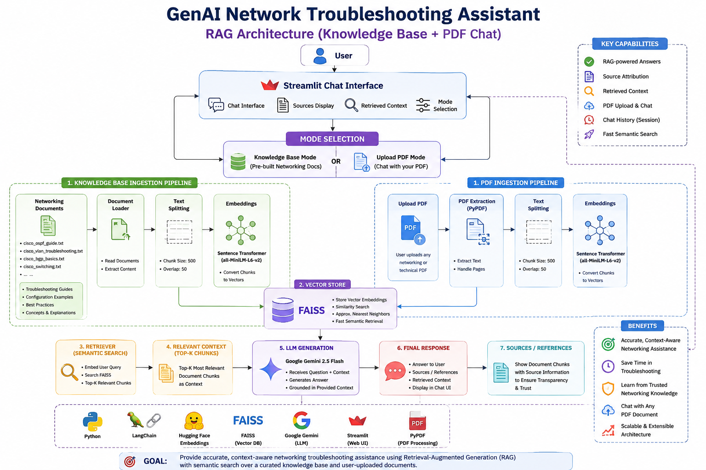

# 🌐 GenAI Network Troubleshooting Assistant

A Retrieval-Augmented Generation (RAG) application that helps network engineers, students, and IT professionals troubleshoot Cisco networking issues using AI-powered semantic search. The application combines FAISS vector search, Sentence Transformer embeddings, and Google's Gemini LLM to generate accurate, context-aware answers grounded in a networking knowledge base.

The application also supports **chatting with custom PDF documents**, allowing users to upload technical manuals, networking guides, or study material and interact with them using natural language.

## 🚀 Live Demo

🔗 https://genai-network-assistant-4gjwnob9aeus6xabjedofu.streamlit.app/

---

## ✨ Features

### Knowledge Base Mode

* Cisco networking troubleshooting assistant
* RAG-based question answering
* FAISS semantic search
* Gemini-powered responses
* Source attribution
* Retrieved context visualization
* Chat-style interface

### PDF Chat Mode

* Upload custom PDF documents
* Automatic text extraction and chunking
* Dynamic vector database creation
* Semantic search over uploaded documents
* AI-powered question answering from PDF content

---

## 🏗️ System Architecture



### Knowledge Base Workflow

User Query
↓
Streamlit Chat UI
↓
FAISS Retriever
↓
Relevant Cisco Documents
↓
Gemini 2.5 Flash
↓
Grounded Response + Sources

### PDF Chat Workflow

Upload PDF
↓
Text Extraction (PyPDF)
↓
Chunking
↓
Sentence Transformer Embeddings
↓
FAISS Vector Store
↓
Gemini 2.5 Flash
↓
Answer from Uploaded PDF

---

## 🛠️ Tech Stack

| Category        | Technology                |
| --------------- | ------------------------- |
| Language        | Python                    |
| LLM             | Gemini 2.5 Flash          |
| Framework       | LangChain                 |
| Vector Database | FAISS                     |
| Embeddings      | all-MiniLM-L6-v2          |
| Frontend        | Streamlit                 |
| PDF Processing  | PyPDF                     |
| Deployment      | Streamlit Community Cloud |

---

## 📂 Project Structure

```text
genai-network-assistant/
│
├── app.py
├── ingest.py
├── rag_pipeline.py
├── pdf_ingest.py
├── pdf_chat.py
├── test_rag.py
├── test_pdf.py
├── test_pdf_chat.py
├── requirements.txt
├── .gitignore
│
├── data/
│   ├── cisco_ospf_guide.txt
│   ├── cisco_vlan_troubleshooting.txt
│   ├── cisco_bgp_basics.txt
│   └── cisco_switching.txt
│
├── assets/
│   ├── home.png
│   ├── ospf-query.png
│   ├── etherchannel-query.png
│   └── architecture.png
│
└── faiss_index/
```

---

## 📸 Application Preview

### Home Page


### OSPF Troubleshooting


### EtherChannel Troubleshooting


---

## ⚡ Installation

### Clone Repository

```bash
git clone https://github.com/SatishSwami/genai-network-assistant.git
cd genai-network-assistant
```

### Create Virtual Environment

```bash
python -m venv venv
```

### Activate Environment

```bash
venv\Scripts\activate
```

### Install Dependencies

```bash
pip install -r requirements.txt
```

### Configure API Key

Create a `.env` file:

```env
GOOGLE_API_KEY=YOUR_GEMINI_API_KEY
```

### Build Vector Database

```bash
python ingest.py
```

### Run Application

```bash
streamlit run app.py
```

---

## 🔍 Example Questions

### Knowledge Base Mode

* Why is OSPF not forming adjacency?
* How do I troubleshoot inter-VLAN routing?
* BGP neighbor stuck in ACTIVE state.
* EtherChannel not forming between switches.
* Hosts in the same VLAN cannot communicate.

### PDF Chat Mode

* Summarize this document.
* What are the key networking concepts discussed?
* Explain OSPF from this PDF.
* What troubleshooting steps are recommended?
* Give a summary of Chapter 2.

---

## 🎯 Key Learning Outcomes

* Retrieval-Augmented Generation (RAG)
* Vector Databases (FAISS)
* Semantic Search
* Embedding Models
* Prompt Engineering
* LangChain Pipelines
* PDF Processing and Retrieval
* Streamlit Application Development
* LLM Integration with Gemini
* Cloud Deployment

---

## 🚧 Future Improvements

* Conversation memory
* Hybrid retrieval (keyword + semantic search)
* Larger networking knowledge base
* Multi-vendor support (Cisco, Juniper, MikroTik)
* User authentication
* Chat export functionality
* Feedback and answer rating system
* Docker deployment

---

## 👨‍💻 Author

**Satish Swami**

B.E. Electronics & Telecommunication Engineering
MIT Academy of Engineering, Pune

GitHub: https://github.com/SatishSwami

Live Demo: https://genai-network-assistant-4gjwnob9aeus6xabjedofu.streamlit.app/

---

## ⭐ If you found this project useful, consider giving it a star.
