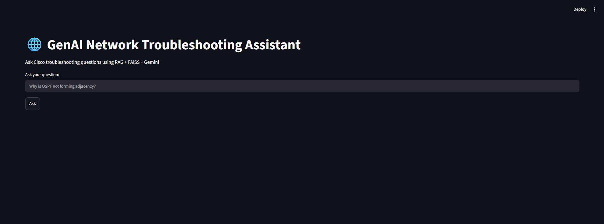
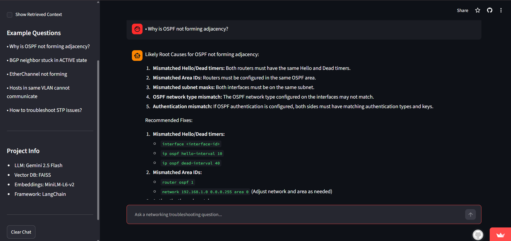
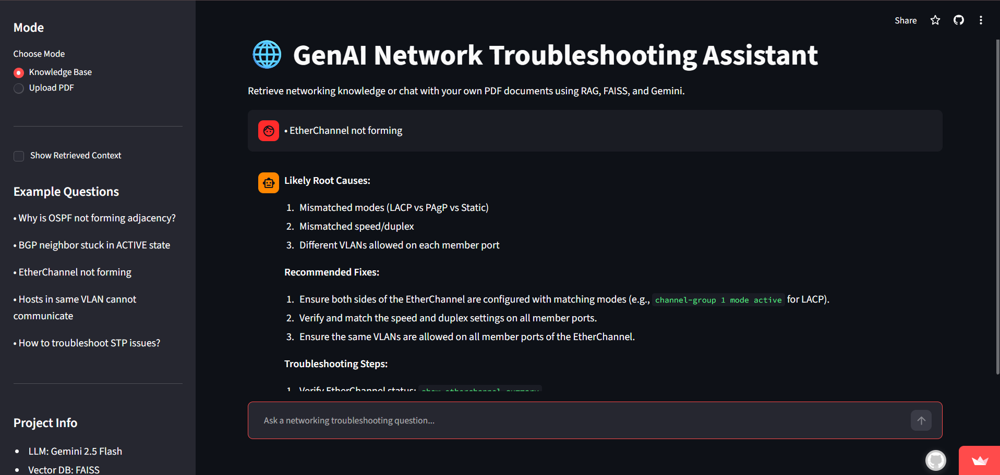

# 🌐 GenAI Network Troubleshooting Assistant

A Retrieval-Augmented Generation (RAG) chatbot designed to assist network engineers, students, and IT professionals in troubleshooting Cisco networking issues. The application combines semantic search using FAISS and Sentence Transformers with Google's Gemini LLM to generate accurate, context-aware answers grounded in a networking knowledge base.

## 🚀 Features

* RAG-based question answering system
* Semantic search using FAISS vector database
* Gemini-powered response generation
* Source attribution for transparency
* Interactive Streamlit web interface
* Cisco networking troubleshooting knowledge base
* Fast local retrieval with vector embeddings

---

## 🏗️ Architecture

```text
User Query
     │
     ▼
Streamlit UI
     │
     ▼
FAISS Retriever
     │
     ▼
Relevant Cisco Documents
     │
     ▼
Gemini LLM
     │
     ▼
Grounded Response + Sources
```

---

## 🛠️ Tech Stack

| Category        | Technology                               |
| --------------- | ---------------------------------------- |
| Language        | Python                                   |
| LLM             | Gemini 2.5 Flash                         |
| Framework       | LangChain                                |
| Vector Database | FAISS                                    |
| Embeddings      | Sentence Transformers (all-MiniLM-L6-v2) |
| Frontend        | Streamlit                                |
| Environment     | Python Virtual Environment               |

---

## 📂 Project Structure

```text
genai-network-assistant/
│
├── app.py
├── ingest.py
├── rag_pipeline.py
├── test_rag.py
├── requirements.txt
├── .gitignore
│
├── data/
│   ├── cisco_ospf_guide.txt
│   ├── cisco_vlan_troubleshooting.txt
│   ├── cisco_bgp_basics.txt
│   └── cisco_switching.txt
│
├── assets/
│   ├── home.png
│   ├── ospf-query.png
│   └── etherchannel-query.png
│
└── faiss_index/
```

---

## 📸 Application Preview

### Home Page



### OSPF Troubleshooting



### EtherChannel Troubleshooting



---

## ⚡ Installation

### Clone Repository

```bash
git clone https://github.com/SatishSwami/genai-network-assistant.git
cd genai-network-assistant
```

### Create Virtual Environment

```bash
python -m venv venv
```

Activate:

```bash
venv\Scripts\activate
```

### Install Dependencies

```bash
pip install -r requirements.txt
```

### Configure API Key

Create a `.env` file:

```env
GOOGLE_API_KEY=YOUR_GEMINI_API_KEY
```

### Build Vector Database

```bash
python ingest.py
```

### Run Application

```bash
streamlit run app.py
```

---

## 🔍 Example Questions

* Why is OSPF not forming adjacency?
* How do I troubleshoot inter-VLAN routing?
* BGP neighbor stuck in ACTIVE state.
* EtherChannel not forming between switches.
* Hosts in the same VLAN cannot communicate.

---

## 🎯 Key Learning Outcomes

* Retrieval-Augmented Generation (RAG)
* Vector Databases and Semantic Search
* Embedding Models
* Large Language Models (LLMs)
* Prompt Engineering
* LangChain Pipelines
* Streamlit Deployment
* Knowledge Base Construction

---

## 🚧 Future Improvements

* Support PDF document ingestion
* Chat history and conversation memory
* Hybrid search (keyword + semantic)
* Larger networking knowledge base
* Multi-vendor support (Cisco, Juniper, MikroTik)
* Cloud deployment on Streamlit Community Cloud
* User feedback and answer rating system

---

## 👨‍💻 Author

**Satish Swami**

B.E. Electronics & Telecommunication Engineering
MIT Academy of Engineering, Pune

GitHub: https://github.com/SatishSwami

---

## ⭐ If you found this project useful, consider giving it a star.
